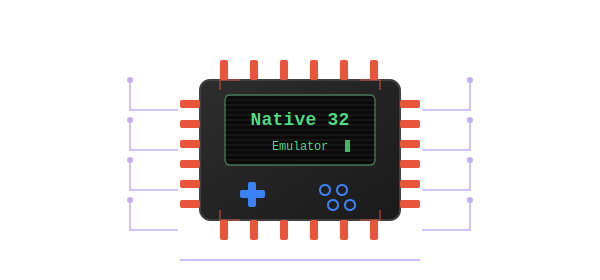

# Native32 Emulator —— A Native32 game emulator written in Rust

<p align="center">
  
</p>

<p align="center">
  <a href="https://github.com/jiangxincode/Native32Emu/actions/workflows/ci.yml"></a>
  <a href="https://github.com/jiangxincode/Native32Emu/releases/latest"></a>
  <a href="https://github.com/jiangxincode/Native32Emu/releases"></a>
  <a href="https://sonarcloud.io/dashboard?id=jiangxincode_Native32Emu"></a>
  <a href="LICENSE"></a>
</p>

Native32 is a game format developed by Sunplus for DVD player and TV chipsets (circa 2005–2011). Games use `.smf`, `.sgm`, or `.ssl` file extensions and feature a stack-based, ActionScript-like virtual machine with raster graphics.

## Features

- **Full Native32 format support** — file loading, header decryption, resource table parsing
- **YUV & ARGB image decoding** — with packbits/RLE decompression and color space conversion
- **Action bytecode VM** — 36 opcodes covering arithmetic, logic, string ops, control flow, sprites, and I/O
- **Sprite/movie system** — animation, cloning, visibility control, depth-sorted rendering
- **Audio playback** — MP3 music and raw 16-bit PCM sound effects
- **MPEG-1 cutscenes** — pure-Rust MPEG-1 video + MP2 audio decoder plays `SSL_PlayNext` logo/cutscene videos (no C dependency); skippable with A/B
- **ZIP archive support** — load game packages directly from `.zip` files (auto-extracts and loads FHUI.smf)
- **Keyboard input** — configurable key remapping
- **Save system** — `.ssl_sav` file persistence
- **SSL multi-file content** — seamless switching between game levels/files
- **CLI controls** — scaling, fullscreen, volume adjustment
- **RetroArch integration** — libretro core for use with RetroArch frontend

## Usage

### Standalone Mode

Download the latest binary from the [Releases](https://github.com/jiangxincode/Native32Emu/releases) page.

The basic usage is list below, but there are many more options for controlling the behavior of the emulator. See the [Command-line Options](docs/CLI-Options.md) documentation for the full list of options.

```bash
# Basic usage
native32-emu path/to/game.smf

# Load from ZIP archive (auto-extracts and loads FHUI.smf)
native32-emu path/to/game.zip

# Fullscreen mode
native32-emu --fullscreen game.smf
```

**ZIP mode**: When loading from a `.zip` file, the emulator starts the FHUI
menu. Selecting a game launches it; pressing **ESC** during gameplay returns to
the menu. Pressing ESC on the menu itself exits the emulator. When loading a
`.smf` file directly, ESC exits as usual.

### RetroArch Mode

Native32Emu can be used as a libretro core with RetroArch, allowing you to play Native32 games with RetroArch's features like shaders, netplay, and achievements.

1. **Download the libretro core** from the [Releases](https://github.com/jiangxincode/Native32Emu/releases) page
2. **Install the core**:
   - Copy `native32emu_libretro.dll` (or `.so`/`.dylib`) to RetroArch's `cores/` directory
   - Copy `native32emu_libretro.info` to RetroArch's `info/` directory
3. **Load the core in RetroArch**:
   - Open RetroArch
   - Select "Load Core" → "Native32 (Native32Emu)"
   - Select "Load Content" and choose a `.smf`, `.sgm`, `.ssl`, or `.zip` game file

#### RetroArch on Android

The libretro core also runs on Android and can be reused by most Android
RetroArch-based frontends. See [Android Libretro Core](docs/Android-Libretro-Core.md)
for install and build instructions.

#### Supported Features

- ✅ Video output (XRGB8888 pixel format)
- ✅ Audio output (RAW PCM, stereo)
- ✅ Input handling (D-Pad + A/B buttons)
- ✅ Game loading (.smf, .sgm, .ssl, .zip files)
- ⚠️ MP3 audio (not yet implemented — only RAW PCM works)
- ❌ Save states (not yet implemented)
- ✅ Core options (audio volume, key auto-repeat timing, swap A/B, auto-skip cutscenes)

#### Core Options

Configurable from RetroArch's *Quick Menu → Core Options* (audio volume, key
auto-repeat timing, swap A/B, auto-skip cutscenes). See
[Core Options](docs/Core-Options.md) for the full list.

#### RetroPad Button Mapping

| RetroPad Button | Native32 Keycode | Action |
|----------------|------------------|--------|
| D-Pad Left | 0x0200 | Left |
| D-Pad Right | 0x0400 | Right |
| D-Pad Up | 0x1c00 | Up |
| D-Pad Down | 0x1e00 | Down |
| A (SNES East) | 0x8800 | B / Menu |
| B (SNES South) | 0x4000 | A |

#### Audio Notes

- **RAW PCM**: Fully supported (11025Hz for YUV games, 22050Hz for ARGB games)
- **MP3**: Not yet supported in libretro mode (games using MP3 will have no music)
- Audio is output as stereo (mono sources are duplicated to both channels)

## Building

Requires [Rust](https://www.rust-lang.org/tools/install) (stable).

### Standalone Mode (Default)

```bash
cargo build -p native32emu --release
cargo run -p native32emu --release -- path/to/game.smf
cargo run -p native32emu --release -- -f path/to/game.smf
```

The binary is produced at `target/release/native32-emu`.

### Libretro Core (for RetroArch)

```bash
cargo build -p native32emu-libretro --release
```

Cargo names the cdylib after its lib target, so this produces `native32emu.dll`
on Windows (`libnative32emu.so` on Linux, `libnative32emu.dylib` on macOS) under
`target/release/`. RetroArch expects the core file to be named
`native32emu_libretro.<ext>`, so rename it accordingly before dropping it into
RetroArch's `cores/` directory.

For Android cross-compilation, see [Android Libretro Core](docs/Android-Libretro-Core.md).

#### Distributing via RetroArch's Online Updater

Work to make the core installable directly from RetroArch (Online Updater > Core
Downloader) — the buildbot recipe, the `libretro-super` info file, documentation,
and their current status — is tracked in
[issue #20](https://github.com/jiangxincode/Native32Emu/issues/20).

## Testing

Run the unit tests:

```bash
cargo test --workspace
```

There is also a smoke test that loads every available game, runs it for a number
of frames, and checks that the emulator neither panics nor produces a blank
frame. It needs the (non-distributed) game assets, so it is `#[ignore]`d by
default and run on demand:

```bash
# Uses <repo>/tmp/native32_game by default, or set NATIVE32_GAME_DIR
cargo test -p native32emu-core --test smoke -- --ignored --nocapture
```

## Architecture

```
crates/
├── native32emu-core/            # Platform-independent emulator engine (library)
│   └── src/
│       ├── lib.rs               # Crate root (module declarations)
│       ├── emulator.rs          # Shared Emulator + VmHost (both front-ends)
│       ├── actions.rs           # Action opcode enum (36 opcodes)
│       ├── action_vm.rs         # Stack-based virtual machine
│       ├── audio_engine.rs      # MP3/PCM audio (rodio for standalone, buffer for libretro)
│       ├── content_loader.rs    # SSL multi-file content switching
│       ├── dat_loader.rs        # .dat metadata / thumbnail decoder (front-end menu)
│       ├── des_constants.rs     # DES permutation tables and S-boxes
│       ├── error.rs             # Error types
│       ├── file_browser.rs      # FHUI front-end game-list directory enumeration
│       ├── file_loader.rs       # File I/O, header parsing, resource tables
│       ├── frame_player.rs      # Main timeline frame playback (30fps)
│       ├── header_decryptor.rs  # Custom DES ECB header decryption
│       ├── image_decoder.rs     # YUV 4:2:0 and ARGB1555 image decoders
│       ├── input_handler.rs     # Input to keycode mapping (keyboard / RetroPad)
│       ├── renderer.rs          # Frame rendering with depth sorting
│       ├── save_manager.rs      # Save data persistence (.ssl_sav)
│       └── sprite_system.rs     # Movie/sprite instance management
├── native32emu/                 # Standalone binary (-> native32-emu)
│   └── src/
│       ├── main.rs              # Window loop and thin front-end
│       └── standalone/
│           ├── cli.rs           # Command-line argument parsing
│           └── gamepad_overlay.rs  # On-screen virtual gamepad overlay
└── native32emu-libretro/        # libretro cdylib (-> native32emu_libretro.{dll,so,dylib})
    ├── native32emu_libretro.info   # RetroArch core metadata
    └── src/
        ├── lib.rs               # cdylib crate root
        └── libretro/
            ├── api.rs           # Exported libretro functions (retro_init, retro_run, etc.)
            ├── callbacks.rs     # Callback management for video/audio/input
            ├── constants.rs     # libretro constants
            ├── logger.rs        # Bridges the `log` crate to the libretro log interface
            └── types.rs         # libretro type definitions
```

## Game Compatibility

Game resources can be downloaded from [Baidu Netdisk](https://pan.baidu.com/s/1CuNeJe-RKXG_E-LhdI5ldg?pwd=aloy).

All 84 Native32 games in the test suite load and run without fatal errors.

| Category | Count | Status |
|----------|-------|--------|
| Main Menu | 1 | ✅ Pass |
| EACT (Action) | 11 | ✅ Pass |
| EELA (Educational) | 32 | ✅ Pass |
| EPOP (Hot/Featured) | 9 | ✅ Pass |
| EPUZ (Puzzle) | 24 | ✅ Pass |
| ESPG (Sport) | 3 | ✅ Pass |
| ETAB (Chess/Board) | 4 | ✅ Pass |
| **Total** | **84** | **✅ All Passed** |

For detailed game list with screenshots and descriptions, see [Game Compatibility](docs/Game-Compatibility.md).

## Contribute

Contributions are welcome! Whether you're interested in fixing bugs, adding features, improving documentation, or testing game compatibility, we'd love your help. See [CONTRIBUTING.md](docs/CONTRIBUTING.md) for details.

## Acknowledgments

- [n32emu](https://github.com/gatecat/n32emu) by Myrtle Shah — an earlier and simple Python implementation
- [BootlegGames Wiki](https://bootleggames.fandom.com/wiki/Native_32) — hardware documentation and game catalog

## Community

Welcome to join the QQ group to discuss Native32 games, report issues, or share childhood memories:


## License

This project is licensed under the [BSD 3-Clause License](LICENSE).
