# Native32 游戏清单

> Native32 是凌阳（Sunplus）为其 DVD 播放器和电视芯片开发的游戏格式，约 2008-2010 年广泛应用于便携式 DVD 播放器、车载后座显示器等设备。
>
> 游戏由"土豆工作室"专业团队制作，专门为 DVD 产品打造。

---

## 主打游戏 / 热门游戏（EPOP — 9 款）

| # | 游戏名 | 英文名 | 文件名 | 图片 | 游戏介绍 |
|---|--------|--------|--------|------|----------|
| 1 | 赤刃 | Bloody Blade | EBBLADE.smf |  | 经典的横版动作过关（ACT）游戏。赤刃一族被灭族，20 年后幸存的后裔女刺客开始复仇之旅。 |
| 2 | 极速任务 | Express | EExpress.smf |  | 类赛车多角色游戏，含城市、高速、荒野、F1 赛道场景，有障碍物和道具。 |
| 3 | 枪火 | Gun Fire | EGUNFIRE.smf | 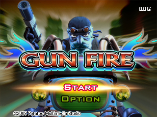 | 横版射击（STG）游戏。骑上心爱的机车，拿起火枪，在枪火纷飞的世界去打击黑社会，对抗独裁者，消灭生化怪兽。 |
| 4 | 钢铁风暴 | Metal Storm | EMETAL.smf |  | 四向自由卷轴射击游戏。游戏虚构了一个近未来的世界，军事科技以现实世界科技为基础有一定发展，武器与现实世界相似。 |
| 5 | 海盗 | Pirate | Epirate.smf |  | 以"炸弹人"为原型的休闲桌面（PUZ）游戏。小海盗雷克获得藏宝图后开启冒险。 |
| 6 | 符文之语 | Rune Word | ERuneWod.smf | 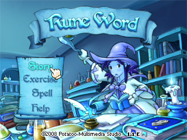 | 类似于对对碰的游戏。年轻的魔法学徒艾莉进入炼金房修炼，在大魔导师雷斯林的指导下学习一个又一个的魔法。各种符文代表不同属性的魔力。 |
| 7 | 风暴之翼 | Storm | ESTORM.smf | 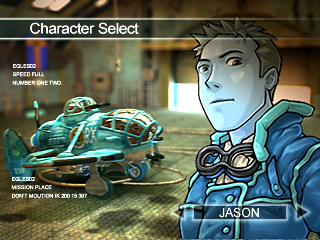 | 纵版射击（STG）游戏。王牌飞行员 Jason 和 Blanche 深入 239 区侦察，遭遇敌方终极战机及隐藏秘密武器。 |
| 8 | 汉语学堂一 | School 1 | SCHOOL1.smf | 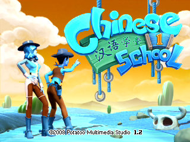 | 中英文双语学习（ELA）软件，全 3D 图画，涵盖服装、水果、室内、身体、头部、野餐六大类。 |
| 9 | 汉语学堂二 | School 2 | SCHOOL2.smf | 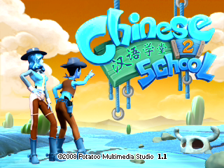 | 中英文双语学习（ELA）软件，全 3D 图画，配以中英文双重语音，涵盖动物、快餐、汽车、数字、颜色、自然六大类。 |

---

## 动作游戏（EACT — 11 款）

| # | 游戏名 | 英文名 | 文件名 | 图片 | 游戏介绍 |
|---|--------|--------|--------|------|----------|
| 1 | 赤刃 | Bloody Blade | EBBLADE.smf | 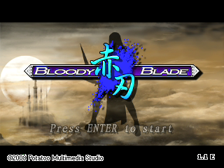 | 经典的横版动作过关（ACT）游戏。赤刃一族被灭族，20 年后幸存的后裔女刺客开始复仇之旅。 |
| 2 | 枪火 | Gun Fire | EGUNFIRE.smf |  | 横版射击（STG）游戏。骑上心爱的机车，拿起火枪，在枪火纷飞的世界去打击黑社会，对抗独裁者，消灭生化怪兽。 |
| 3 | 钢铁风暴 | Metal Storm | EMETAL.smf | 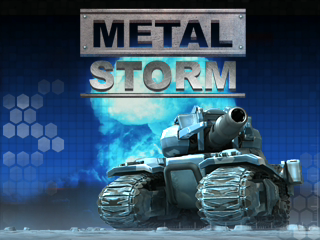 | 四向自由卷轴射击游戏。游戏虚构了一个近未来的世界，军事科技以现实世界科技为基础有一定发展，武器与现实世界相似。 |
| 4 | 海盗 | Pirate | Epirate.smf | 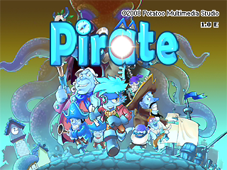 | 以"炸弹人"为原型的休闲桌面（PUZ）游戏。小海盗雷克获得藏宝图后开启冒险。 |
| 5 | 风暴之翼 | Storm | ESTORM.smf |  | 纵版射击（STG）游戏。王牌飞行员 Jason 和 Blanche 深入 239 区侦察，遭遇敌方终极战机及隐藏秘密武器。 |
| 6 | 小小我 | Little Me | LittleMe.smf | 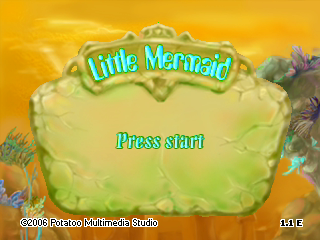 | — |
| 7 | 失落之剑 | Lost Sword | LostSwor.smf | 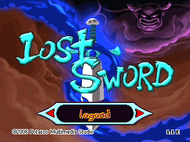 | — |
| 8 | 鼓舞 | Music Game | MusicGam.smf | 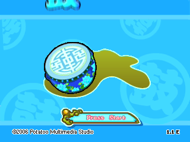 | 音乐游戏，相当于劲舞团一样的玩法，但操作较其简单，跟随节奏提示按下方向键。 |
| 9 | 泡泡精灵 | PoPo Fun | PoPoFun.smf | 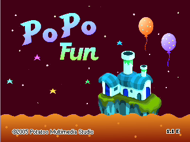 | 经典的踩气球游戏，控制主角用脚踩爆敌人头顶气球来消灭对手。 |
| 10 | 少林功夫 | ShaoLin Kung Fu | ShaoLinK.smf | 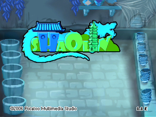 | — |
| 11 | 三只小猪 | Three Pigs | ThreePig.smf | 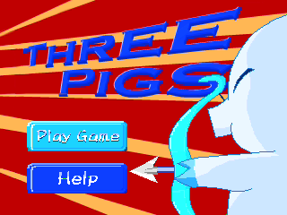 | — |

---

## 益趣游戏（EPUZ — 25 款）

| # | 游戏名 | 英文名 | 文件名 | 图片 | 游戏介绍 |
|---|--------|--------|--------|------|----------|
| 1 | 坏男孩 | Bad Boy | Bad Boy.smf | 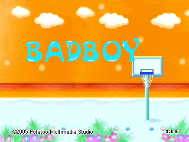 | — |
| 2 | 铃铛女孩 | Bell Girls | BellGirl.smf | 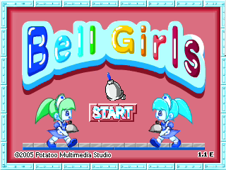 | — |
| 3 | 小猫快跑 | Cat Run | Cat Run.smf | 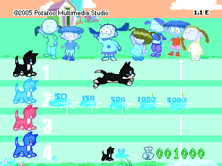 | 选择喜欢的小猫下注，控制它参加跑步比赛。不同名次获得不同奖金，取决于玩家操作。 |
| 4 | CE 城堡 | CE Castle | CeCastle.smf | 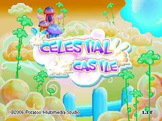 | — |
| 5 | 龙 | Dragon | Dragon.smf | 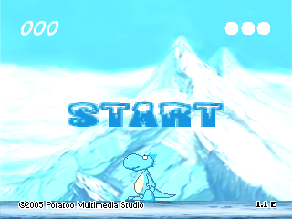 | — |
| 6 | 仙女博士 | Dr. Fairy | DrFairy.smf | 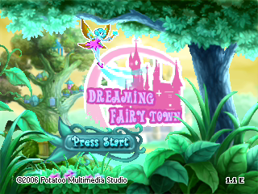 | — |
| 7 | 元素大冒险 | Element | Element.smf |  | 俄罗斯方块原型游戏。不同形状的方块需要合理组合，连成横行被收集消除。红色方块增加特殊效果。 |
| 8 | 符文之语 | Rune Word | ERuneWod.smf |  | 类似于对对碰的游戏。年轻的魔法学徒艾莉进入炼金房修炼，在大魔导师雷斯林的指导下学习一个又一个的魔法。各种符文代表不同属性的魔力。 |
| 9 | 食物雨 | Food Rain | FoodRain.smf | 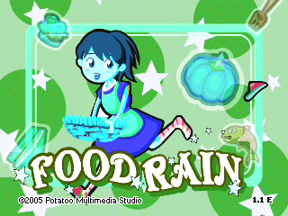 | — |
| 10 | 青蛙 | Frog | Frog.smf | 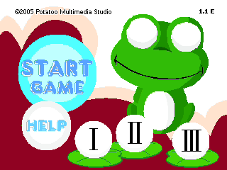 | — |
| 11 | 水果派对 | Fruit Party | FruParty.smf | 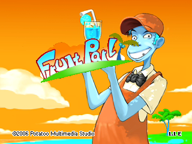 | — |
| 12 | 宝石森林 | Gem Woods | GemWoods.smf | 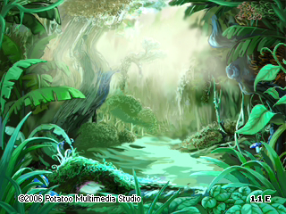 | — |
| 13 | 翻翻乐 | Guess | Guess.smf | 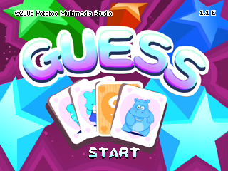 | 古老纸牌翻牌游戏，挑战记忆力。牌面有卡瓦伊小动物。 |
| 14 | 躲猫猫 | Hide & Seek | HideSeek.smf | 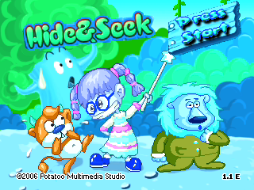 | — |
| 15 | 幸运兔 | Lucky Rabbits | LRabbits.smf | 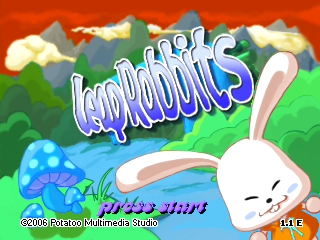 | — |
| 16 | 打地鼠 | Mouse | Mouse.smf | 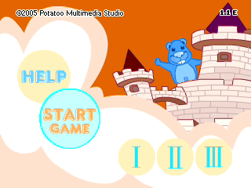 | 经典打地鼠游戏。地鼠破坏庄稼，玩家拿起武器教训它们。 |
| 17 | 木偶 | Mushu Mus | MushuMus.smf | 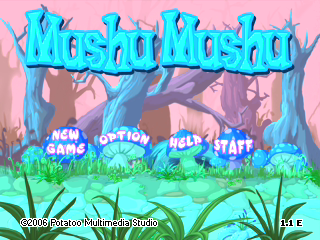 | — |
| 18 | 猴子 | Nau Orang | NauOrang.smf | 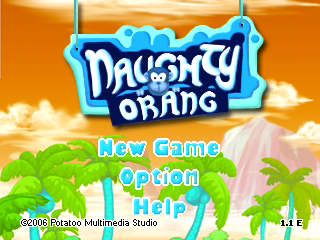 | — |
| 19 | 果园 | Orchard | Orchard.smf | 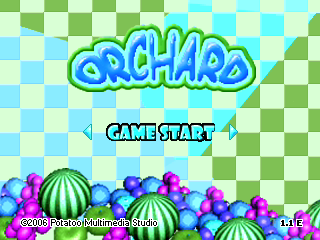 | — |
| 20 | 海盗 C | Pirate C | PirateC.smf | 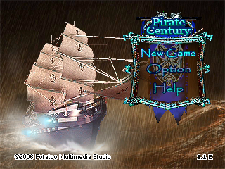 | — |
| 21 | 小熊拼图 | Puzzle | Puzzle.smf | 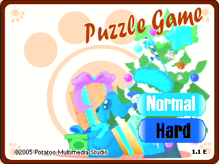 | 经典拼图游戏。游戏开始时打乱图片，经过努力成功后带来成就感和喜悦。 |
| 22 | 星空吞吞 | Snake Mania | SnakeMa.smf | 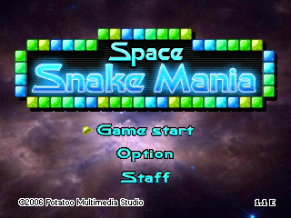 | 贪吃蛇原型游戏。角色自动前进，吃到食物身体加长，速度加快，碰到边缘或自身则失败。 |
| 23 | 数独 | Sudoku | Sudoku.smf | 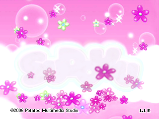 | — |
| 24 | 零猎人 | Zero Hunt | ZeroHunt.smf | 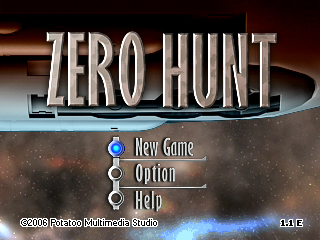 | — |

---

## 教育游戏（EELA — 32 款）

| # | 游戏名 | 英文名 | 文件名 | 图片 | 游戏介绍 |
|---|--------|--------|--------|------|----------|
| 1 | 加 21 | Adding 21 | Adding21.smf | 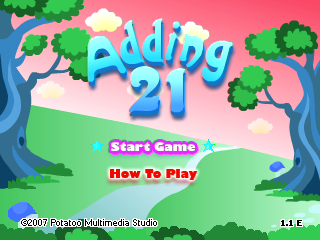 | — |
| 2 | 字母排序 | Alphabetical Order | AlpOrder.smf | 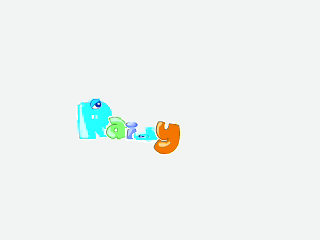 | — |
| 3 | 动物朋友 | Animal Friends | AnimalFr.smf | 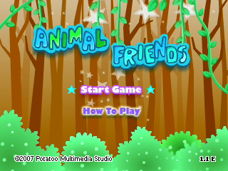 | — |
| 4 | 动物一 | Animals 1 | Animals1.smf | 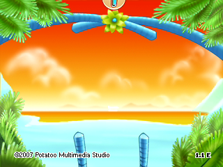 | — |
| 5 | 动物二 | Animals 2 | Animals2.smf | 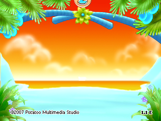 | — |
| 6 | 小鸡回家 | Chicklin | Chicklin.smf | 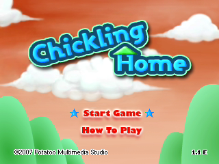 | 关于简单加减乘除运算正误判断的练习，适合多个年龄层幼儿，判断数学等式是否正确。 |
| 7 | 颜色魔法 | Colors Magic | ColorsMa.smf | 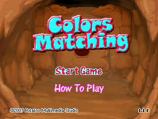 | — |
| 8 | 阅读理解 | Comprehension | Comprehe.smf | 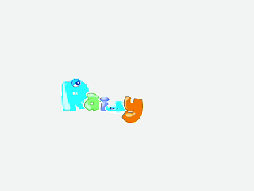 | — |
| 9 | 数字猎人 | Digital Hunt | DigiHunt.smf | 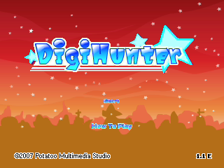 | — |
| 10 | 找匹配 | Find The Match | FindTheM.smf | 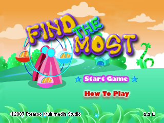 | — |
| 11 | 水果一 | Fruits 1 | Fruits1.smf | 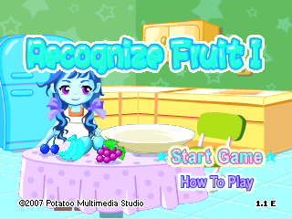 | — |
| 12 | 水果二 | Fruits 2 | Fruits2.smf | 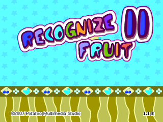 | — |
| 13 | 地理 | Geography | Geograph.smf | 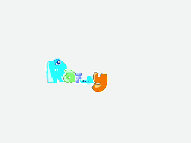 | — |
| 14 | 生物 | Living Things | LivingTi.smf | 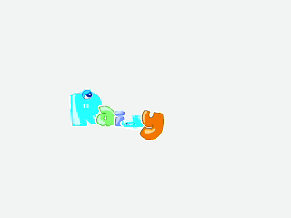 | — |
| 15 | 魔法链 | Magic Chain | MagicCha.smf |  | — |
| 16 | 魔法 A | Magical A | MagicalA.smf |  | — |
| 17 | 数学讨价还价 | Math Bargain | MathBarg.smf |  | — |
| 18 | 猴子军队 | Monkey Army | MonkeyAr.smf |  | — |
| 19 | 比大小 | More Or Less | MoreOrLe.smf |  | 关于比较大小的游戏，适合较低年龄幼儿，判断两边宝石数量并填上 `<、=、>` 连接符。 |
| 20 | 音乐基础 | Music Basic | MusicBas.smf |  | — |
| 21 | 单词拼块 | Ordered Blocks | OrdBlock.smf |  | 关于英语单词识别和拼写的游戏，游戏会读出一个单词，控制字母块完成拼写。 |
| 22 | 重新拼字 | Re-Letter | ReLetter.smf |  | — |
| 23 | 看图说话 | Reads Picture | ReadsPic.smf |  | — |
| 24 | 汉语学堂一 | School 1 | SCHOOL1.smf |  | 中英文双语学习（ELA）软件，全 3D 图画，涵盖服装、水果、室内、身体、头部、野餐六大类。 |
| 25 | 汉语学堂二 | School 2 | SCHOOL2.smf |  | 中英文双语学习（ELA）软件，全 3D 图画，配以中英文双重语音，涵盖动物、快餐、汽车、数字、颜色、自然六大类。 |
| 26 | 搜索者 | Seeker | Seeker.smf |  | — |
| 27 | 简单算术 | Simple Arithmetic | SimpleAr.smf |  | 讲述 Raidy 和 Annie 训练 Borry 跑步跳高的故事，数学基础加减乘除运算练习，从泡泡中选择缺少的数字。 |
| 28 | 快速算术 | Speed Arithmetic | SpeedAri.smf |  | — |
| 29 | 超级加法 | Super Add | SuperAdd.smf |  | — |
| 30 | 我们的时间 | Us Time | UsTime.smf |  | — |
| 31 | 单词选择 | Word Choice | WordChoi.smf |  | — |
| 32 | 单词车间 | Workshop | Workshop.smf |  | 关于英语单词拼写的练习，适合较低年龄层幼儿，选择字母将单词补充完整，难度逐渐增加。 |

---

## 竞技游戏（ESPG — 3 款）

| # | 游戏名 | 英文名 | 文件名 | 图片 | 游戏介绍 |
|---|--------|--------|--------|------|----------|
| 1 | 篮球 | Basketball | Basketba.smf |  | — |
| 2 | 保龄球 | Bowling | Bowling.smf |  | 保龄球游戏，传统规则上增加障碍赛概念，选好位置和力量击倒全部球瓶。 |
| 3 | 极速任务 | Express | EExpress.smf |  | 类赛车多角色游戏，含城市、高速、荒野、F1 赛道场景，有障碍物和道具。 |

---

## 棋牌游戏（ETAB — 4 款）

| # | 游戏名 | 英文名 | 文件名 | 图片 | 游戏介绍 |
|---|--------|--------|--------|------|----------|
| 1 | 幸运 21 | Lucky 21 | Lucky 21.smf |  | 以标准的 21 点赌博游戏为背景。K、Q、J 和 10 牌都算作 10 点，A 牌既可算作 1 点也可算作 11 点，其余所有 2 至 9 牌均按其原面值计算。 |
| 2 | 幸运宝盒 | Lucky Box | LuckyBox.smf |  | 由苹果机、单人梭哈、赌骰子 3 种赌博小游戏组成的棋牌类游戏。苹果机中对水果下注，不同水果有不同赔率。 |
| 3 | 天堂 777 | Paradise 777 | Parad777.smf |  | 模拟老虎机的游戏，游戏获胜机率从开始高到后来很低。在游戏期间玩家可获得一定的道具，并具有特殊效果。 |
| 4 | 长空斗士 | Sky Fighter | SkyFight.smf |  | 类似于飞行棋的游戏，游戏中需要掷出骰子，得到点数，选择行动的飞机，飞机按点数行走。只有掷出 6 点，才能将一架新的飞机由机场出发。 |

---

## 其他

| # | 游戏名 | 英文名 | 文件名 | 图片 |
|---|--------|--------|--------|------|
| 1 | 主菜单 | FHUI | FHUI.smf |  |

---
